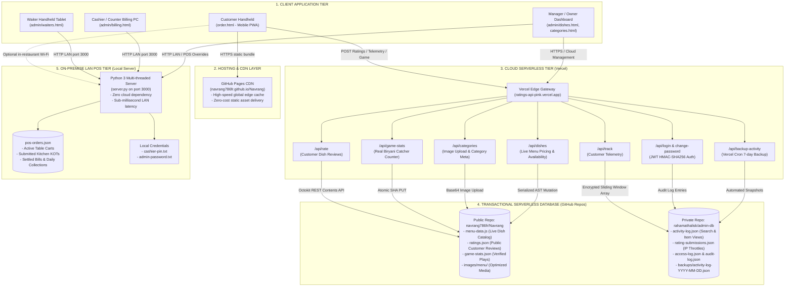
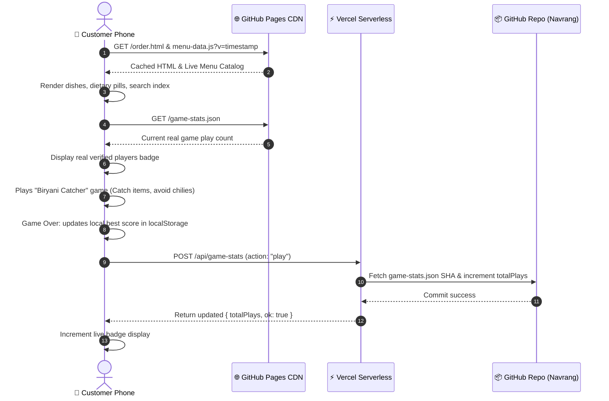
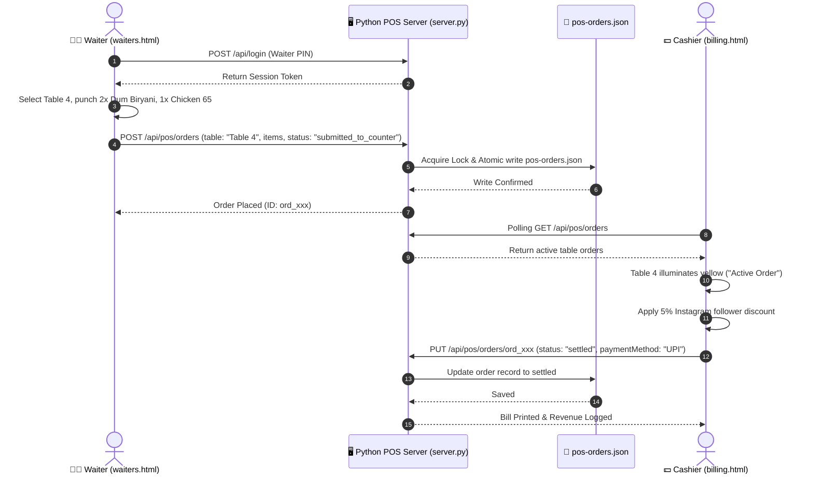
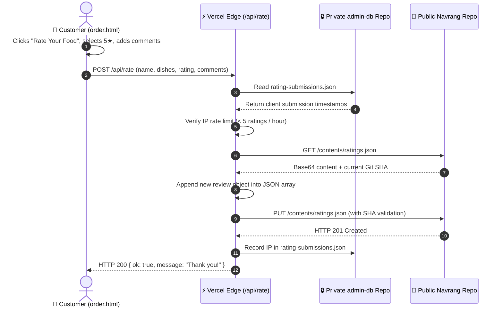

# Navrang Platform — System Architecture & Technology Stack

An end-to-end architectural blueprint of the **Navrang Family Restaurant & Digital Ordering Platform**, detailing system components, data flows, cloud infrastructure, on-premise POS synchronization, and technology stacks.

---

## 1. High-Level Architecture Overview



---

## 2. Core Architecture Subsystems

The Navrang platform is split into three decoupled subsystems designed for **zero downtime**, **zero operational infrastructure cost**, and **high survivability**:

### A. Customer Experience PWA (`order.html`)
* **Dual-Language Client Engine (`order-app.js`)**: Real-time instantaneous toggle between English and Telugu (`తెలుగు`) with dynamic string dictionary translation for search placeholders, dietary badges, categories, and allergen warnings.
* **Instant Client-side Search & Multi-filter**: Fuzzy search across English dish names, Telugu script dish titles, ingredients, and categories. Instant filtering by Veg/Non-Veg, Top Best Sellers, and price brackets (<₹100, ₹100–₹200, ₹200–₹300, ₹300+).
* **Biryani Catcher Mini-Game**: HTML5 Canvas 2D game running at 60 FPS directly within the waiting bar. Built with retro pixel-art physics, particle thruster sparks, catch explosion bursts, and a procedural Web Audio API sound synthesizer (no external MP3 asset dependencies).
* **Real Game Plays Sync Engine**: Synchronized counter between client `localStorage`, `game-stats.json`, and `/api/game-stats` on Vercel. Increments automatically when players compete and syncs across devices.
* **Split-Bill Calculator**: Native utility for dine-in groups to divide total food checks among guest counts, round figures, copy breakdown text to WhatsApp, or render downloadable HTML5 screenshot receipts.
* **Social & Community Integration**: Direct topbar icon buttons, footer subscribe widgets, and floating action button (FAB) speed-dials linking to the restaurant's **YouTube Channel** (`https://www.youtube.com/channel/UCgJrjCtAEO39sfaaTyd_EHA`) and **Instagram** (`@navrang786fr` 5% OFF discount campaign).

---

### B. On-Premise LAN Floor & POS Server (`server.py`)
* **Local Floor-to-Counter Sync**: Built using Python 3's `http.server.SimpleHTTPRequestHandler` with `socketserver.ThreadingMixIn` running on `0.0.0.0:3000`.
* **Zero-Cloud LAN Dependency**: When local Internet broadband drops, dining operations continue without interruption. Waiter handhelds (`admin/waiters.html`) and counter billing PCs (`admin/billing.html`) communicate directly over the local Wi-Fi router.
* **Thread-Safe Atomic File Storage**: Orders are persisted to `pos-orders.json` using atomic temporary file swaps (`.tmp.{pid}.{threadid}`) shielded by `threading.Lock()` to prevent race conditions during peak dining rush.
* **Multi-Role Authentication**: Dedicated roles for Cashiers (PIN-based access with custom fallback in `cashier-pin.txt`) and Administrators/Managers (with overrides stored in `admin-password.txt`).

---

### C. Cloud Serverless Edge & Microservices (`ratings-api/`)
* **Stateless Microservices on Vercel**: Node.js edge lambdas that expose REST endpoints (`/api/rate`, `/api/track`, `/api/game-stats`, `/api/categories`, `/api/dishes`, `/api/login`).
* **Git-as-a-Database Architecture**: Uses GitHub's REST Contents API as a serverless database:
  * Public tables: `menu-data.js`, `ratings.json`, `game-stats.json`
  * Private security tables: `activity-log.json`, `rating-submissions.json`, `access-log.json`, `audit-log.json`
* **Optimistic Concurrency & Retry Loops**: Mutations fetch the target file's Git SHA, execute AST modifications or array appends, and commit back with retry loops (`maxRetries = 4`) to gracefully handle concurrent HTTP 409 conflicts.
* **Sliding-Window IP Rate Limiting**: Protects against review bombing, tracking spam, and denial-of-service by throttling requests over 5-minute and 60-minute sliding windows per client IP.

---

## 3. End-to-End Data Flows

### Flow 1: Customer Digital Menu & Real Game Play Sync


---

### Flow 2: Floor Waiter to Counter POS Billing Workflow


---

### Flow 3: Food Review Submission with Serverless Git-as-a-Database


---

## 4. Complete Technology Stack Matrix

| Category | Technology / Library | Purpose & Implementation |
| :--- | :--- | :--- |
| **Frontend Core** | **Vanilla HTML5 (Semantic)** | PWA shell, accessible forms, meta tags, safe-area inset management for notch devices. |
| **Styling & Theme** | **Vanilla CSS3 Custom Properties** | Bespoke design system (`--maroon`, `--turmeric-gold`, `--leaf-bg`), frosted glass backdrop filters, responsive cards. |
| **Typography** | **Google Web Fonts** | `Yatra One` (Heritage brand headings), `Aref Ruqaa` (Urdu calligraphy), `Karla` (Clean body text), `IBM Plex Mono` (Billing receipts), `Noto Sans Telugu` (Vernacular Telugu script). |
| **Client Scripting** | **Vanilla JavaScript (ES6+)** | Zero runtime dependencies. Modular controllers for search, filtering, lightbox, internationalization, and analytics. |
| **Game Engine** | **HTML5 Canvas 2D API** | Custom 60 FPS physics engine for Biryani Catcher with touch dragging, banking angle effects, combo streaks, and particle bursts. |
| **Sound System** | **Web Audio API** | Real-time procedural audio synthesis generating chimes, catch bells, and warning buzzes without downloading external MP3s. |
| **Local POS Server** | **Python 3 (`http.server`)** | Lightweight multi-threaded local HTTP server (`server.py`) handling real-time floor ordering and billing synchronization over LAN. |
| **Serverless Backend** | **Node.js (Vercel Serverless)** | Microservices deployed to Vercel handling ratings, telemetry tracking, game play counters, categories, and JWT authentication. |
| **Database Engine** | **GitHub Contents REST API** | Git-as-a-Database transactional persistence with optimistic locking via Git SHAs and conflict auto-retries. |
| **Authentication** | **HMAC-SHA256 JWT** | Stateless tokens for admin session validation with role-based access control (Admin, Cashier, Waiter). |
| **Rate Limiting** | **In-memory Sliding Window** | Per-IP throttling across 5-minute (telemetry) and 60-minute (ratings) windows. |
| **Cloud Hosting** | **GitHub Pages CDN** | High-availability, edge-cached static hosting for customer menus and restaurant pages. |
| **Microservice Cloud**| **Vercel Platform** | Edge hosting for `ratings-api-pink.vercel.app` with zero cold-start penalty on Node.js lambdas. |
| **Social Channels** | **YouTube & Instagram APIs** | Integrated channel link (`UCgJrjCtAEO39sfaaTyd_EHA`) and Instagram (`@navrang786fr`) 5% discount campaign. |

---

## 5. File & Directory Structure

```text
d:\Navrang\
├── index.html                   # Desktop & web landing presentation page
├── order.html                   # Flagship mobile digital menu & order PWA
├── order-app.js                 # Complete client logic (EN/TE, search, game, split bill)
├── menu-data.js                 # Central database of categories & dish inventory
├── ratings.json                 # Verified public customer reviews and feedback
├── game-stats.json              # Verified global count of Biryani Catcher games played
├── server.py                    # Multi-threaded on-premise LAN POS & Table Sync Server
├── pos-orders.json              # Local store of active, submitted, and settled table bills
├── config.js                    # Environment endpoint configuration
│
├── admin/                       # On-premise POS & Manager Control Suite
│   ├── login.html               # Staff login with cashier PIN / admin credentials
│   ├── billing.html             # Cashier counter terminal (bill settlement, print receipts)
│   ├── waiters.html             # Waiter handheld order punch tablet interface
│   ├── daily-collections.html   # End-of-day revenue, settlement, and payment audits
│   ├── pos-audit.html           # Live operational event stream & change log
│   ├── dishes.html              # Menu catalog editor (live prices, availability)
│   ├── categories.html          # Category order manager and photo uploader
│   ├── ratings.html             # Customer feedback moderation & insights
│   ├── activity.html            # Customer search query and traffic telemetry
│   ├── admin-shared.js          # Shared authentication, token verification, and navbar
│   └── admin-style.css          # Design system stylesheet for admin portals
│
├── ratings-api/                 # Cloud Serverless Microservices (Vercel)
│   ├── package.json             # Microservice package descriptor
│   ├── vercel.json              # Vercel cron schedules and edge configuration
│   └── api/
│       ├── rate.js              # Append customer rating to ratings.json
│       ├── track.js             # Record search/view telemetry to activity-log.json
│       ├── game-stats.js        # Global Biryani Catcher player counter endpoint
│       ├── dishes.js            # Update dish inventory in menu-data.js
│       ├── categories.js        # Category CRUD and base64 image processor
│       ├── login.js             # Staff JWT token issuance
│       ├── change-password.js   # Secure credential updater
│       ├── backup-activity.js   # Automated 7-day activity snapshot worker
│       └── _lib/
│           ├── auth.js          # JWT verification & claims validation
│           ├── github.js        # GitHub Contents API reader/writer with retry loops
│           ├── menuData.js      # AST parser and serializer for menu-data.js
│           ├── rateLimit.js     # Sliding window rate limiting engine
│           └── requestInfo.js   # Client IP, geo-location, and device detector
│
└── images/                      # Media assets
    ├── app/                     # Icons, Instagram banners, logo marks
    ├── menu/                    # Compressed dish photos (categories & item thumbnails)
    └── qr-cards/                # High-contrast scannable QR card codes (EN/TE)
```

---

## 6. Key Reliability & Security Attributes

1. **Dual-Offline Resilience**: If the internet connection fails, the dining room operates normally via `server.py` over local LAN. If the local POS PC is restarted, customer digital menus on GitHub Pages continue serving QR-code scans uninterrupted.
2. **Zero Plaintext Credentials**: Staff passwords and PINs are securely stored in serverless runtime environment variables and localized configuration files (`admin-password.txt`, `cashier-pin.txt`), with public demo defaults masked.
3. **Data Protection & SAIF Privacy**: Customer IP addresses, cities, and user agents are strictly isolated in the private repository (`admin-db`) and never exposed in client-facing public assets like `ratings.json` or `game-stats.json`.
4. **Edge CDN Cache Busting**: Dynamic menu and inventory scripts are requested with timestamped query parameters (`menu-data.js?v=Date.now()`), guaranteeing that price changes or dish stock statuses take effect instantly on all customer phones.
